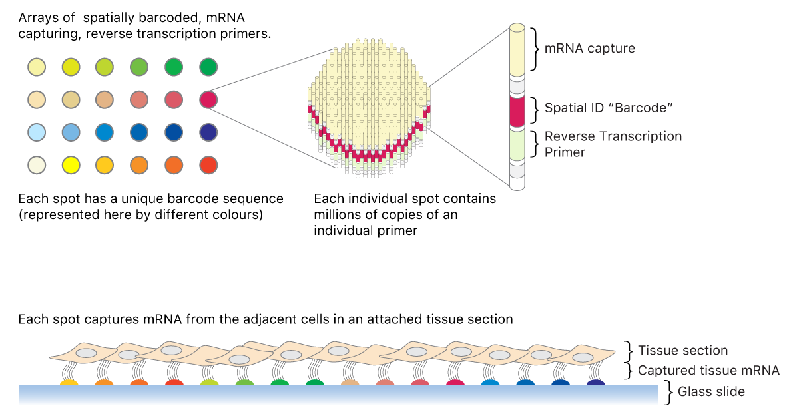

:::::::::::::::::::::::::::::::::::::: questions 

- Which data will we explore in this course?
- How was the study that generated the data designed?
- What are some critical design elements for rigorous, reproducible spatial transcriptomics experiments?

::::::::::::::::::::::::::::::::::::::::::::::::

::::::::::::::::::::::::::::::::::::: objectives

- Describe a spatial transcriptomics experiment.
- Identify important elements for good experimental design.

::::::::::::::::::::::::::::::::::::::::::::::::

## The Data

Recall that tissue is laid on a glass slide containing spots with primers to
capture mRNA. Each spot has a barcode ID indicating its position on the slide.

{alt='A graphic showing printed spots on a glass slide that are identified by a barcode and that contain primers to capture messenger RNA from the tissue laid on top of them'}


In spatial transcriptomics the barcode indicates the spot. Barcodes are generic
identifiers that identify different things in different technologies. A barcode
in single-cell transcriptomics, for example, refers to a single cell, not to a 
spot on a slide. When you see barcodes in ST data, think "spot", not "single 
cell". The graphic above is a bit misleading that way because the spots each 
appear to capture mRNA from only one cell. In fact, one spot can capture mRNA 
from many cells. This is a feature of ST experiments that is distinct from 
single-cell transcriptomics experiments. As a result, many single-cell methods
won't work with ST data. Later we will look at methods to 
["deconvolve" cell types per spot](deconvolve-cell-types-in-a-spot.Rmd) 
to determine whether there are zero, one or many cells per spot.

Count data for each mRNA are mapped back to spots on the slide to indicate the
tissue position of gene expression. An image of the tissue overlaid on the array 
of spots pinpoints spatial gene expression in the tissue.

{alt='A graphic showing printed spots on a glass slide that are identified by a barcode and that contain primers to capture messenger RNA from the tissue laid on top of them'}

Adapted from 
<a href="https://commons.wikimedia.org/wiki/User:Jasquatch">James Chell</a>, <a href="https://commons.wikimedia.org/wiki/File:Spatial_transcriptomics_ii.png">Spatial transcriptomics ii</a>, <a href="https://creativecommons.org/licenses/by-sa/4.0/legalcode" rel="license">CC BY-SA 4.0</a>

Data from the 10X Genomics Visium platform contain gene identifiers in rows
and barcode identifiers in columns. In the graphic below, row 1 of column 1 
contains the mRNA counts for gene 1 at barcode (spot) 1.

{alt='An example of spatial transcriptomics data showing genes in rows and barcodes (spots) in columns'}


::::::::::::::::::::::::::::::::::::: challenge 

## Challenge 1: Row and column sums

What does the sum of a single row signify?  
What does the sum of a single column signify?  

:::::::::::::::::::::::: solution 

Row sum
 
```r
sum('data[1, ]')
```

Column sum
 
```r
sum('data[ , 1]')
```
::::::::::::::::::::::::

:::::::::::::::::::::::::::::::::::::

## Study design


## Important considerations for rigorous, reproducible spatial transcriptomics experiments


::::::::::::::::::::::::::::::::::::: keypoints 

- Use `.md` files for episodes when you want static content
- Use `.Rmd` files for episodes when you need to generate output
- Run `sandpaper::check_lesson()` to identify any issues with your lesson
- Run `sandpaper::build_lesson()` to preview your lesson locally

::::::::::::::::::::::::::::::::::::::::::::::::

