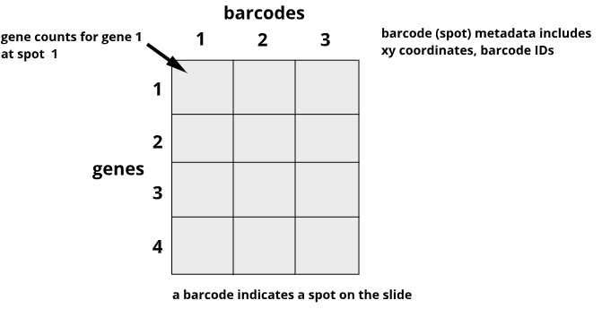

:::::::::::::::::::::::::::::::::::::: questions 

- Which data will we explore in this course?
- How was the study that generated the data designed?
- What are some critical design elements for rigorous, reproducible spatial transcriptomics experiments?

::::::::::::::::::::::::::::::::::::::::::::::::

::::::::::::::::::::::::::::::::::::: objectives

- Describe a spatial transcriptomics experiment.
- Identify important elements for good experimental design.

::::::::::::::::::::::::::::::::::::::::::::::::

## The Data

Recall that tissue is laid on a glass slide containing spots with primers to
capture mRNA. The graphic below details a Visium slide with four capture areas.
Each capture area has arrays of barcoded spots containing oligonucleotides. 
The oligonucleotides each contain a poly(dT) sequence for capture of 
polyadenylated molecules, a unique molecular identifier (UMI) to identify 
duplicate molecules, a spatial barcode shared by all oligonucleotides within the
same spot, and a partial read for library preparation and sequencing. 

{alt='A graphic showing printed spots on a glass slide that are identified by a barcode and that contain oligonucleotides to capture messenger RNA from the tissue laid on top of them'}

In spatial transcriptomics the barcode indicates the spot. Barcodes are generic
identifiers that identify different things in different technologies. A barcode
in single-cell transcriptomics, for example, refers to a single cell, not to a 
spot on a slide. When you see barcodes in ST data, think "spot", not "single 
cell". In fact, one spot can capture mRNA from many cells. This is a feature of 
ST experiments that is distinct from single-cell transcriptomics experiments. As 
a result, many single-cell methods won't work with ST data. Later we will look 
at methods to 
["deconvolve" cell types per spot](deconvolve-cell-types-in-a-spot.Rmd) 
to determine the number and types of cells in each spot. Spots can contain zero,
one, or many cells.

Count data for each mRNA are mapped back to spots on the slide to indicate the
tissue position of gene expression. An image of the tissue overlaid on the array 
of spots pinpoints spatial gene expression in the tissue.

{alt='A graphic showing printed spots on a glass slide that are identified by a barcode and that contain primers to capture messenger RNA from the tissue laid on top of them'}

Adapted from 
<a href="https://commons.wikimedia.org/wiki/User:Jasquatch">James Chell</a>, <a href="https://commons.wikimedia.org/wiki/File:Spatial_transcriptomics_ii.png">Spatial transcriptomics ii</a>, <a href="https://creativecommons.org/licenses/by-sa/4.0/legalcode" rel="license">CC BY-SA 4.0</a>

Data from the 10X Genomics Visium platform contain gene identifiers in rows
and barcode identifiers in columns. In the graphic below, row 1 of column 1 
contains the mRNA counts for gene 1 at barcode (spot) 1.

{alt='An example of spatial transcriptomics data showing genes in rows and barcodes (spots) in columns'}


::::::::::::::::::::::::::::::::::::: challenge 

## Challenge 1: Row and column sums

What does the sum of a single row signify?  
What does the sum of a single column signify?  

:::::::::::::::::::::::: solution 

The row sum is the total expression of one gene across all spots on the slide.
 
```r
sum('data[1, ]')
```

The column sum is the total expression of all genes for one spot on the slide.
 
```r
sum('data[ , 1]')
```
::::::::::::::::::::::::

:::::::::::::::::::::::::::::::::::::


## Study design
Good experimental design plays a critical role in obtaining reliable and 
meaningful results and is an essential feature of rigorous, reproducible
experiments. Randomization minimizes bias, moderates experimental error 
(a.k.a. noise), and ensures that our comparisons between treatment groups are 
valid. Randomization  also accounts for or cancels out effects of “nuisance” 
variables like the time or day of the experiment, the investigator or 
technician carrying out the work, equipment calibration, exposure to light or 
ventilation in animal rooms, or other variables that are not being studied but 
that do influence the responses. Randomization balances out the effects of 
nuisance variables between treatment groups by giving an equal probability for 
an experimental unit to be assigned to any treatment group.

The graphic below shows a Visium workflow for fresh-frozen tissues.

{alt='A Visium spatial transcriptomics workflow with fresh-frozen tissue'}


``` r
knitr::include_graphics("fig/fresh-frozen-workflow.png")
```

<div class="figure" style="text-align: center">
<a href="https://www.10xgenomics.com/library/6f2b8a" target="_blank"></a>
<p class="caption">Visium spatial transcriptomics workflow with fresh-frozen tissue. Optimal Cutting Temperature (OCT), immunofluorescence (IF), hematoxylin and eosin (H&E), reverse transcription (RT), quantitative polymerase chain reaction (qPCR), quality control (QC), adenosine tailing (A-tailing), single index PCR (SI-PCR). Graphic from Grant application resources for Visium products</p>
</div>

::::::::::::::::::::::::::::::::::::: challenge 

## Challenge 2: Treatment and control samples
You plan to place samples of treated tissue on one slide and samples of the 
controls on another slide. 
What will happen when it is time for data analysis?
What could you have done differently?

:::::::::::::::::::::::: solution 


::::::::::::::::::::::::

:::::::::::::::::::::::::::::::::::::

::::::::::::::::::::::::::::::::::::: challenge 

## Challenge 3: Time points
Your study requires data collection at three time points: 5, 10, and 15 weeks. 
At the end of 5 weeks, you will run samples through the entire Visium workflow. 
You will repeat this for the 10- and 15-week samples when each of those time 
points is reached.
What will happen when it is time for data analysis?
What could you have done differently?

:::::::::::::::::::::::: solution 
The issue is that time point is now confounded. A better approach would be to 
start the 15-week samples, then 5 weeks later start the 10-week samples, then
5 weeks later start the 5-week samples. This way you can run all of your samples
at the same time. None of your samples will have spent a long time in the 
freezer, so you won't need to worry about the variation that might cause. You 
won't need to worry about the time point confounding the results.

::::::::::::::::::::::::

:::::::::::::::::::::::::::::::::::::

We will use data from [Transcriptome-scale spatial gene expression in the human dorsolateral prefrontal cortex by Maynard et al, Nat Neurosci 24, 425–436 (2021).](https://doi.org/10.1038/s41593-020-00787-0)

``{r brain-tissue-section, fig.link = 'fig/tissue-block-with-layers.png', fig.cap = "Tissue blocks were excised from human dorsolateral prefrontal cortex. Tissue blocks include six cortical layers and underlying white matter (wm).", fig.alt="A human brain showing a section of dorsolateral prefrontal cortex extracted. A block of tissue containing six cortical layers and an underlying layer of white matter is excised from the section."}

Adapted from 
<a href="https://doi.org/10.1038/s41593-020-00787-0">Maynard et al,  Nat Neurosci 24, 425–436 (2021)</a>. <a href="https://www.biorender.com">Created with BioRender.com</a>.


``{r experimental-design, fig.link = 'fig/experimental-design.png', fig.cap = "Slides contain tissue samples from three neurotypical adult subjects. Each slide contains two pairs of replicates containing directly adjacent tissue sections 10 microns in size. The second pair of replicates is located 300 microns posterior to the first pair. A total of 12 samples were assayed with Visium.", fig.alt="Three Visium slides showing four spatial capture areas each. Each slide contains directly adjacent serial tissue sections for one subject. The second pair of samples contains tissue sections that are 300 microns posterior to the first pair of samples."}

Adapted from 
<a href="https://doi.org/10.1038/s41593-020-00787-0">Maynard et al,  Nat Neurosci 24, 425–436 (2021)</a>. <a href="https://www.biorender.com">Created with BioRender.com</a>.

::::::::::::::::::::::::::::::::::::: challenge 

## Challenge 4: What do you notice?
What do you notice about the experimental design that might create issues during 
data analysis? 
Why might the authors have done the experiment this way? 
Is there anything that can be done about this?

:::::::::::::::::::::::: solution 


::::::::::::::::::::::::

:::::::::::::::::::::::::::::::::::::
## Important considerations for rigorous, reproducible spatial transcriptomics experiments

randomization
statistical power


::::::::::::::::::::::::::::::::::::: keypoints 

- Use `.md` files for episodes when you want static content
- Use `.Rmd` files for episodes when you need to generate output
- Run `sandpaper::check_lesson()` to identify any issues with your lesson
- Run `sandpaper::build_lesson()` to preview your lesson locally

::::::::::::::::::::::::::::::::::::::::::::::::

